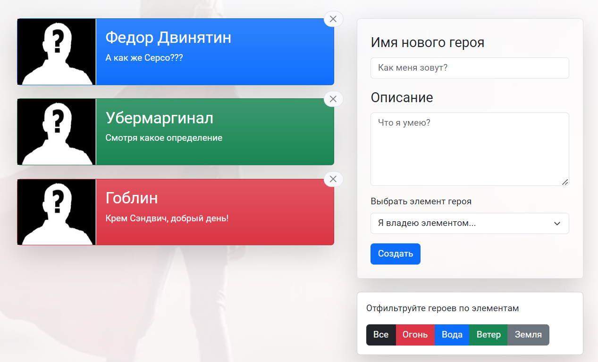
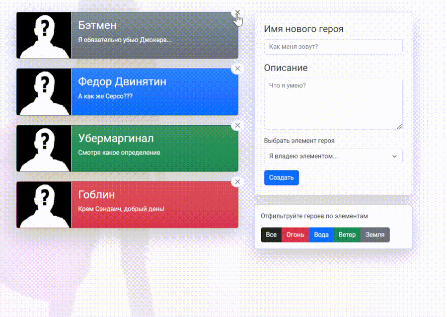
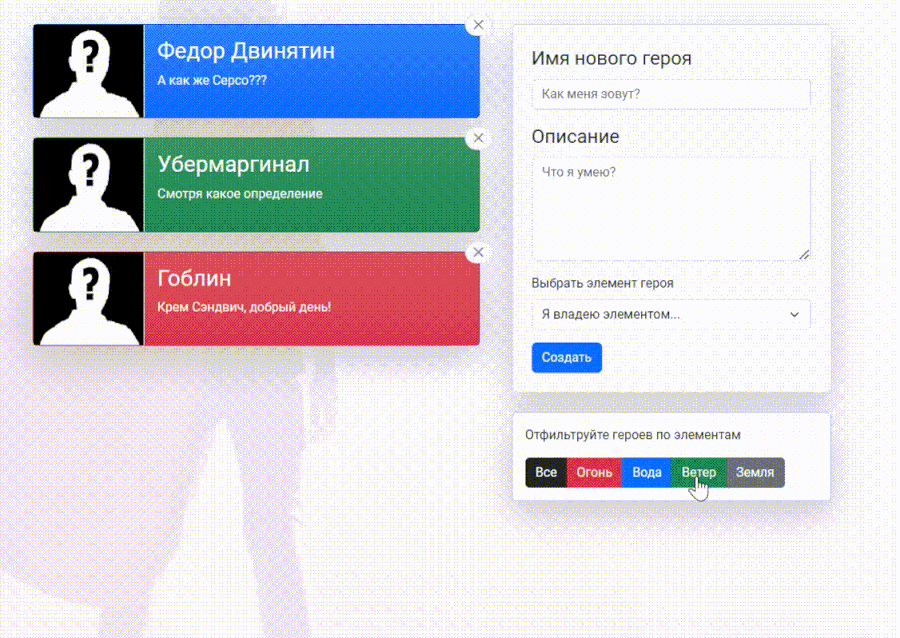

<h1 align="center">Heroes app</h1>

<p align="center">

 


  

## Description

**Easy app with Redux**

🌱 [TAP TO SEE Heroes APP](https://heroes-ochre.vercel.app/)

<p align="center">

All app used Redux. For animation there is 'CSSTransition' bible.
<p></p>

You can add new hero.
</p>

You can delete hero.
</p>

You can filter heroes!
</p>


## Technologies in the project

[](https://skillicons.dev)

## Project setup

```
npm run start - to run server
```